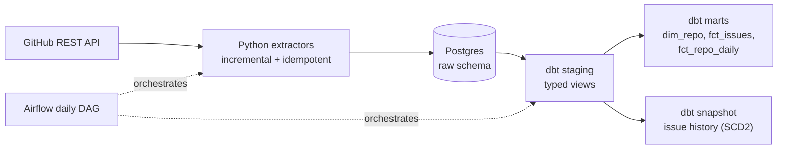

# datastack-pulse


An end-to-end ELT pipeline that tracks the pulse of the modern data stack. It ingests
GitHub activity for dbt, Airflow, Spark, Dagster, Prefect, Delta Lake, Iceberg and DuckDB,
models it with dbt, and orchestrates everything daily with Airflow.

**Stack:** Python · Supabase (Postgres) · dbt Core · Apache Airflow (Astro CLI) · GitHub Actions

## Architecture



The daily DAG loads repo snapshots and issues in parallel, checks source freshness, and then
runs `dbt build` (models, tests and snapshots). Failed tasks retry twice, and an alert
callback fires once retries are exhausted.

## Data model

| Layer | Model | Grain |
|---|---|---|
| raw | `repo_snapshots` | one row per repo per day (full API payload as `jsonb`) |
| raw | `issues` | one row per issue or PR, latest version (upserted) |
| staging | `stg_github__repo_snapshots`, `stg_github__issues` | same grain, flattened and typed |
| marts | `dim_repo` | one row per repository (latest attributes) |
| marts | `fct_issues` | one row per issue or PR, with cycle time (incremental) |
| marts | `fct_repo_daily` | one row per repo per day, with star and fork deltas |
| snapshots | `snap_github__issues` | one row per issue version (SCD type 2) |

## Design decisions

| Decision | Rationale |
|---|---|
| **Idempotent loads** (upsert on primary key) | Re-running any day never creates duplicates |
| **Watermark derived from the data** (`max(updated_at)`) | No separate state table that can drift out of sync |
| **Commit per repository, ascending read order** | A mid-run failure can never advance the watermark past unloaded data |
| **Raw payloads stored as `jsonb`** | Extraction stays dumb; typing and cleaning live in dbt |
| **dbt in its own virtualenv inside the Airflow image** | Avoids dependency conflicts between Airflow and dbt |
| **`source freshness` before `dbt build`** | Stale inputs stop the pipeline instead of producing misleading outputs |
| **Snapshot only on issues** | Repo snapshots already keep one row per day; issues are overwritten and need history |
| **No Spark or Databricks** | The data is tens of thousands of rows; a distributed engine would add cost with no benefit |
| **CI uses `dbt parse` with dummy credentials** | Validates the project without exposing a real database to pull requests |

## Findings

**Method.** Cohort of issues and PRs created between 2026-07-10 and 30 days before the run date, so every item has at least 30 days of follow-up. Items still open count as "not closed". Bot-authored items (accounts of type `Bot`) are excluded. Percentages are only reported when n >= 100. Figures as of October 2026.

| Repo | PRs (n) | PR closed ≤7d | PR closed ≤30d | Issues (n) | Issue closed ≤7d | Issue closed ≤30d |
|---|---|---|---|---|---|---|
| duckdb/duckdb | 1,139 | 71.6% | 82.9% | 502 | 37.3% | 61.0% |
| apache/spark | 1,361 | 66.3% | 81.9% | 24 | n/a | n/a |
| delta-io/delta | 411 | 65.5% | 76.9% | 31 | n/a | n/a |
| dbt-labs/dbt-core | 313 | 64.2% | 73.5% | 354 | 17.8% | 45.5% |
| PrefectHQ/prefect | 170 | 54.7% | 78.8% | 103 | 59.2% | 75.7% |
| apache/airflow | 2,125 | 50.9% | 73.1% | 322 | 24.8% | 42.9% |
| apache/iceberg | 600 | 38.0% | 52.0% | 159 | 8.8% | 17.6% |
| dagster-io/dagster | 134 | 25.4% | 29.1% | 38 | n/a | n/a |

**Takeaways**
- Human-authored PRs are resolved faster than issues in most projects.
- Prefect is the exception: its issues close as fast as its PRs.
- Filtering bots changed the picture. About 63% of Prefect's PRs in the cohort were bot-authored, which inflated its 7-day PR close rate from 54.7% to 72.4%.
- Among repos with enough issue data, Iceberg has the slowest issue turnaround.

## Limitations

- The window covers recently updated items, not each repository's full history.
- "Closed" includes both merged and rejected PRs.
- The bot filter only catches accounts registered as `Bot`; automation running under regular user accounts is not detected.
- Star growth needs history that the API does not provide, so it accumulates from the daily snapshots. A day without a run is a snapshot that cannot be recovered.
- Airflow runs locally via the Astro CLI, so the schedule only fires while Docker is up. A real deployment would run on always-on infrastructure.

## Run it yourself

**Prerequisites:** Python 3.12, Docker, [Astro CLI](https://www.astronomer.io/docs/astro/cli/install-cli),
a free [Supabase](https://supabase.com) project, and a GitHub fine-grained token with read-only access to public repositories.

```bash
git clone https://github.com/kristhoffer14/datastack-pulse.git
cd datastack-pulse
python -m venv .venv && source .venv/bin/activate   # Windows: .\.venv\Scripts\Activate.ps1
pip install -r requirements-dev.txt
cp .env.example .env                                 # then fill in your values
```

Run the pipeline step by step:

```bash
python extract/db.py                    # create raw / staging / marts schemas
python extract/extract_repos.py         # daily repo snapshot
python extract/extract_issues.py        # incremental issues and PRs
cd dbt && dotenv -f ../.env run -- dbt build
```

Or run it orchestrated with Airflow:

```bash
cp .env airflow/.env
cd airflow && astro dev start           # UI at http://localhost:8080
```

If your database password contains `$`, wrap it in single quotes in `airflow/.env`,
otherwise Docker will interpolate it.

## Repository layout

```
extract/    Python extractors (GitHub API -> Postgres raw schema)
dbt/        dbt project: staging, marts, snapshots, tests
airflow/    Astro project with the daily DAG
tests/      pytest unit tests for the extractors
.github/    CI workflow (ruff, pytest, dbt parse)
```

## Roadmap

- Run `dbt build` in CI against a temporary schema
- SQL linting with sqlfluff
- DAG import tests in CI
- A BI dashboard on top of the marts
- A second project on Databricks and Delta Lake, where data volume justifies it

## License

MIT